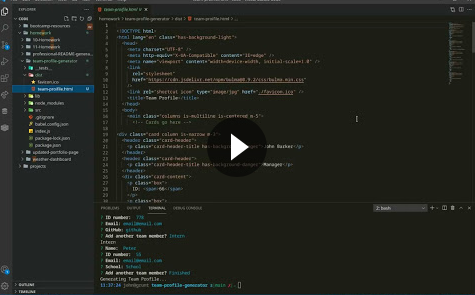

# Team Profile Generator

## Description:

Takes input from the command-line to generate html to display a team comprised of a manager, engineers and interns with various properties such as name and email.

Uses _inquirer_ to accept input from the CLI.

Uses _jest_ to test class functionality.

## Table of Contents:

- [Installation](#installation)
- [Usage](#usage)
- [Walkthrough](#Walkthrough)
- [License](#license)
- [Contributing](#contributing)
- [Tests](#tests)
- [Questions](#questions)

### Installation

Clone the repo then run this command within the repo directory:

`npm install`

### Usage

Change directory to the repository root path and run `node index.js`

### Walkthrough

### License

This repository is licensed under the [MIT](https://opensource.org/licenses/MIT) license.

### Contributing

No contributions at this time.

### Tests

Run this command within the repo directory:

`npm test`

### Questions

If you have any questions, head to my [GitHub](https://github.com/DandyCodes) or send me an email at jdabarker@gmail.com.
